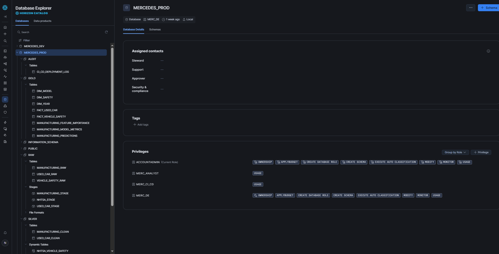
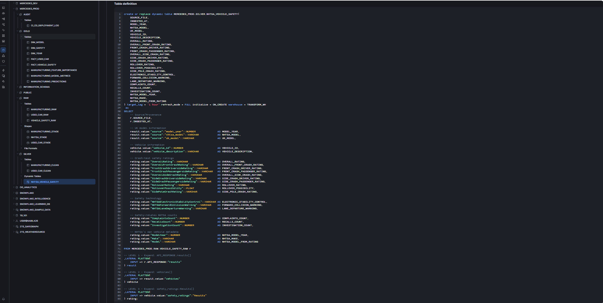
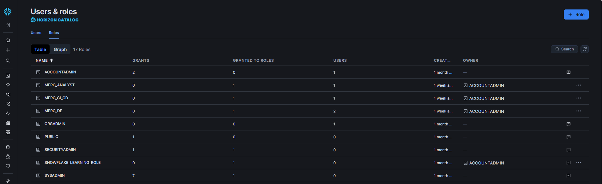

# Validation and CI/CD

## 1. Overview

The project uses automated validation through GitHub Actions and
Snowflake production checks.

The final implementation successfully completed both the CI and CD
workflows.

---

# 2. Continuous Integration

The CI workflow is responsible for validating code changes before
production deployment.

The workflow includes automated project checks and tests.

Conceptually:

```text
Git Push / Pull Request
          |
          v
      GitHub Actions
          |
          v
       CI Workflow
          |
          v
    Automated Tests
          |
      +---+---+
      |       |
     PASS    FAIL
      |       |
      v       v
 Continue    Stop
```

### Final Result
#### CI: PASS

---

# 3. Continuous Deployment

The CD workflow automates the production deployment process.

The workflow includes:
1. NHTSA ingestion
2. Used vehicle data loading
3. Manufacturing data loading
4. Snowflake production deployment
5. Production validation

Conceptually:
```text
GitHub
   |
   v
CD Workflow
   |
   v
Data Loading
   |
   v
Snowflake Deployment
   |
   v
Production Validation
   |
   v
  PASS
```
### Final Result
#### CD: PASS

---

# 4. Snowflake Production Validation

Production validation was performed after deployment.

Validation covered the production environment, including:
- Database objects
- RAW layer
- SILVER layer
- GOLD analytical structures
- Data availability
- Snowflake connectivity
- Deployment completion

Supporting Snowflake evidence includes:  






---

# 5. Validation Philosophy

The deployment workflow is not considered successful solely because
deployment commands execute without errors.

The production environment is explicitly validated after deployment.

```test
Code Change
     |
     v
    CI
     |
     v
Tests Pass
     |
     v
    CD
     |
     v
Production Deployment
     |
     v
Production Validation
     |
     v
Deployment Complete
```

---

# 6. Validation Evidence

Selected evidence is stored under:  
`docs/screenshots`

The screenshots demonstrate:
- Successful CI
- Successful CD
- Snowflake production environment
- Snowflake Dynamic Tables
- Snowflake roles
- Power BI analytical outputs


